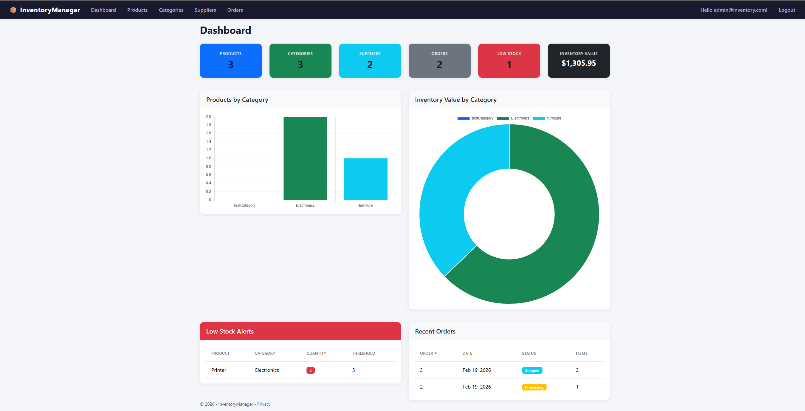
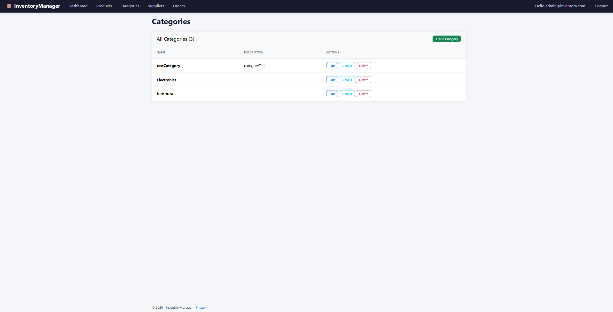

# 📦 InventoryManager

A full-stack inventory management system I built to practice enterprise-level ASP.NET MVC development. The app handles product tracking, order processing, and stock management with role-based access control — the kind of system you'd actually see in a real warehouse or retail operation.

## Screenshots





## Features

- **Dashboard** with live stats, Chart.js charts, and low stock warnings
- **Product management** — full CRUD with search, filtering by category, and sortable columns
- **Order system** — users can place orders, pick products and quantities, and stock updates automatically
- **Categories & Suppliers** — organize products and track vendors
- **Role-based auth** — Admins get full access, Viewers can only browse and place orders
- **Low stock alerts** — flags products when inventory drops below a configurable threshold
- **Unit tests** — xUnit tests covering models, business logic, and controller behavior

## Tech Stack

| Layer          | Technology                  |
| -------------- | --------------------------- |
| Framework      | ASP.NET MVC (.NET 10)       |
| ORM            | Entity Framework Core       |
| Database       | SQL Server (LocalDB)        |
| Authentication | ASP.NET Identity with Roles |
| Frontend       | Bootstrap 5, Chart.js       |
| Testing        | xUnit, EF Core InMemory     |
| Architecture   | MVC Pattern                 |

## Database Schema

```
Category (1) ──── (*) Product (*) ──── (1) Supplier
                        │
                        │
               OrderItem (*) ──── (1) Order
```

## Getting Started

### Prerequisites

- [.NET 10 SDK](https://dotnet.microsoft.com/download)
- SQL Server LocalDB (comes with Visual Studio)

### Setup

```bash
git clone https://github.com/hmasonxD/InventoryManager.git
cd InventoryManager

# configure admin credentials (stored securely, never in source code)
dotnet user-secrets --project InventoryManager/InventoryManager.csproj set "AdminSettings:Email" "admin@inventory.com"
dotnet user-secrets --project InventoryManager/InventoryManager.csproj set "AdminSettings:Password" "Admin123!"

# set up the database
dotnet ef database update --project InventoryManager/InventoryManager.csproj

# run it
dotnet run --project InventoryManager/InventoryManager.csproj

# run tests
dotnet test
```

Then open `http://localhost:5097`

### Test Accounts

| Role   | Email                  | Password           |
| ------ | ---------------------- | ------------------ |
| Admin  | admin@inventory.com    | Admin123!          |
| Viewer | Register a new account | Any valid password |

## Roles & Permissions

| Action                 | Admin | Viewer |
| ---------------------- | ----- | ------ |
| View Dashboard         | ✅    | ✅     |
| Browse Products        | ✅    | ✅     |
| Search & Filter        | ✅    | ✅     |
| Place Orders           | ✅    | ✅     |
| Create / Edit / Delete | ✅    | ❌     |
| Manage Categories      | ✅    | ❌     |
| Manage Suppliers       | ✅    | ❌     |

## Project Structure

```
InventoryManager/                        ← solution root
├── InventoryManager.slnx                ← solution file
├── InventoryManager/                    ← main web app
│   ├── Constants/                       # role name constants
│   ├── Controllers/                     # request handling + authorization
│   ├── Data/                            # DbContext, migrations, seed data
│   ├── Models/                          # entities + ViewModels
│   ├── Views/                           # Razor templates per controller
│   ├── wwwroot/                         # CSS, JS, static files
│   └── Program.cs                       # startup + middleware config
└── InventoryManager.Tests/              ← unit tests
    ├── ProductTests.cs                  # product model + low stock logic
    ├── OrderTests.cs                    # order totals + defaults
    └── DashboardControllerTests.cs      # controller tests with in-memory DB
```

## Testing

Built with xUnit following the **Arrange / Act / Assert** pattern. Tests cover:

- **Product model** — low stock threshold detection across multiple scenarios using `[Theory]` parameterized tests
- **Order model** — subtotal calculations, total summing, default values
- **Dashboard controller** — inventory value calculation, low stock counting, and empty state handling using an EF Core in-memory database

Run all tests:

```bash
dotnet test
```

Run a specific test class:

```bash
dotnet test --filter "FullyQualifiedName~ProductTests"
```

## What I Learned Building This

- How the MVC pattern actually works end to end — routing, model binding, validation
- Entity Framework Core — code-first migrations, eager loading with `.Include()`, deferred execution with `.AsQueryable()`
- ASP.NET Identity — setting up roles, protecting routes with `[Authorize]`, seeding users on startup
- Dependency injection — why controllers ask for services instead of creating them
- Keeping secrets out of source code with `dotnet user-secrets`
- Structuring a .NET solution with separate test projects that mirror the main app
- Writing unit tests that use in-memory databases to avoid needing a real SQL Server
- Stock management logic — deducting inventory on orders, restoring on cancellation, locking prices at order time
